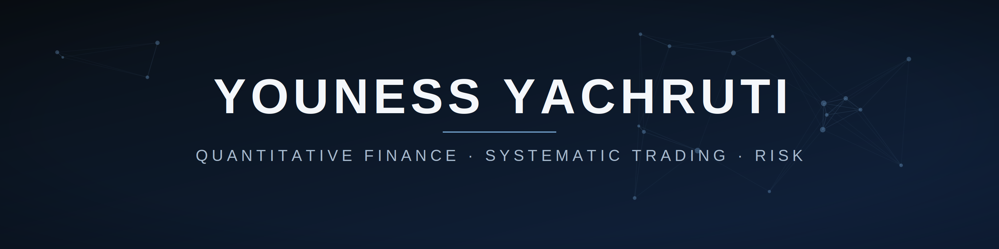
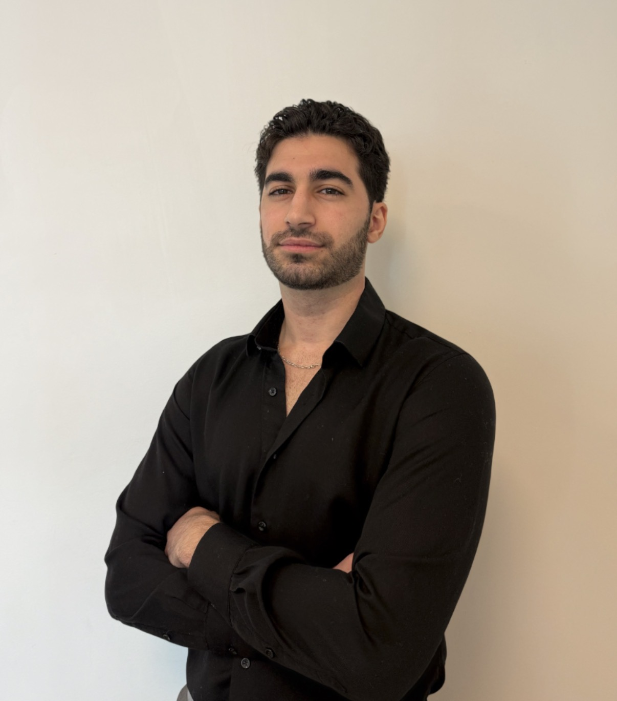

  
  

# Youness Yachruti

Quantitative Finance · Systematic Trading · Risk

<a href="https://www.linkedin.com/in/youness-yachruti/" target="_blank">LinkedIn</a>
<a href="mailto:yyachruti@gmail.com">Email</a>
<a href="https://github.com/youness-yach" target="_blank">GitHub</a>

## About me

<!-- PLACEHOLDER — replace with your final 2–3 sentence copy. -->
I'm a trader who codes: I build systematic trading strategies and the risk
machinery around them, with a research focus on regime detection and
multi-asset systemic risk. I'm currently deepening that into a Pre-MFE at
Baruch College on top of an MSc in Data Analytics from Hult, aiming at
quantitative analyst and systematic trading roles.

## Education

- **Baruch College** — Pre-MFE (Machine Learning with Financial Engineering)
- **Hult International Business School** — MSc, Data Analytics
- **ESTA School** — B.Sc., Business Engineering

## Core expertise

- Systematic Trading & Strategy Design
- Risk Modeling & Regime Detection
- Quantitative Research
- Data Engineering (SQL/Python)
- Machine Learning
- LLM Automation

## Languages

English · French · Arabic

## Featured projects

Project pages are added here as they're built.

## Outside the desk

Away from markets, I train in martial arts and gymnastics, play chess and
poker, and read history and philosophy. Different games, one habit: making
good decisions under pressure and incomplete information — which is most of
what trading is, too.

