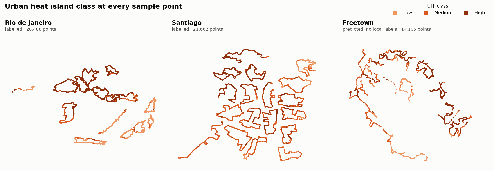
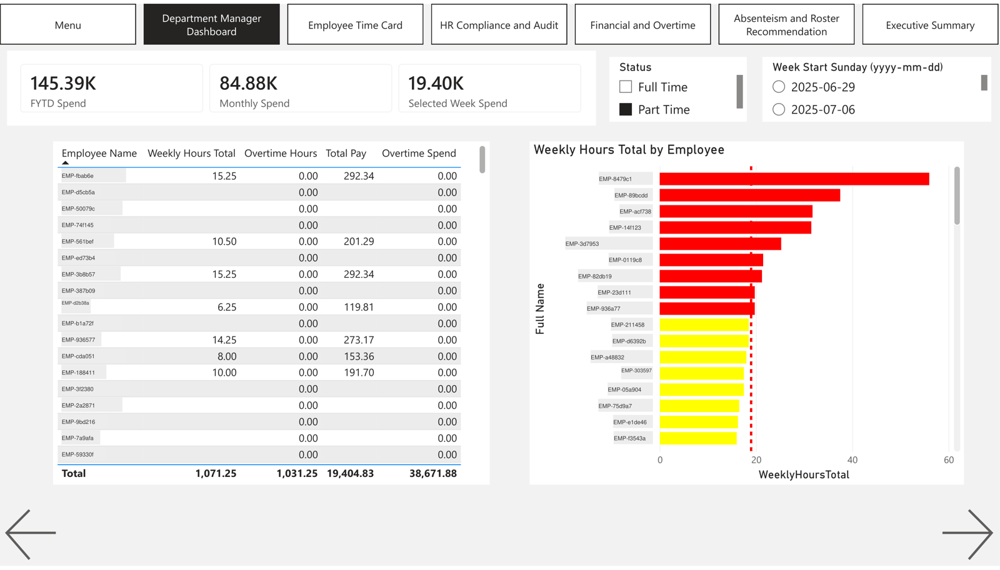
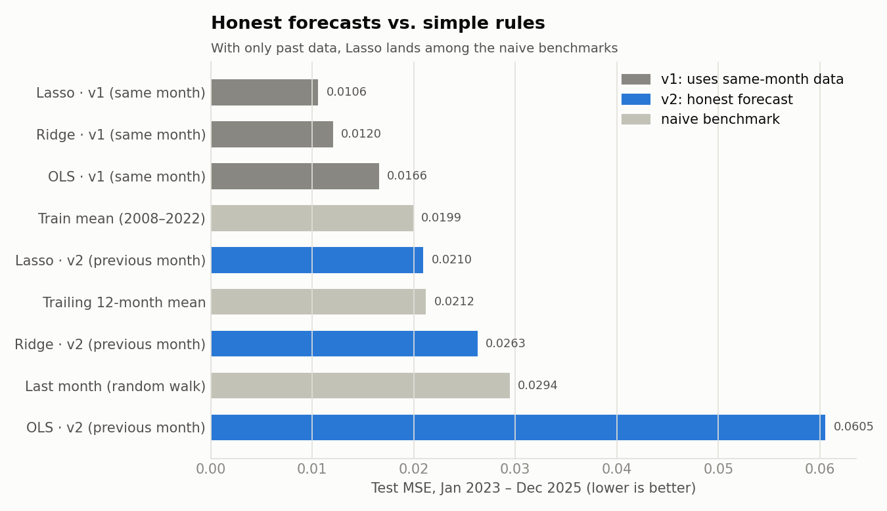
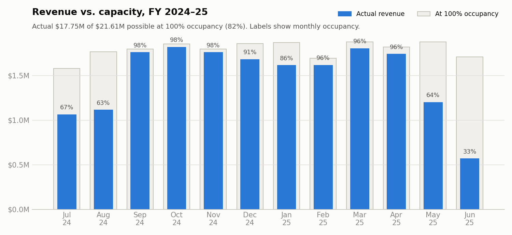
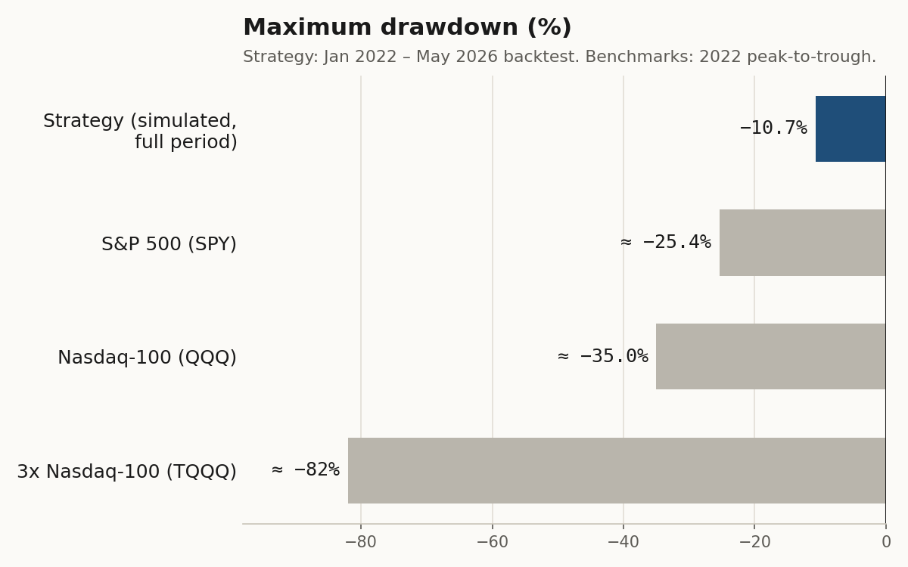

<section class="hero">
<div class="hero-text">
<p class="eyebrow">Quantitative research · Data science · Trading</p>
<h1>Youness Yachruti</h1>
<p class="lead">Quantitative researcher and data scientist. I build systematic trading and risk models in Python, I'm developing my C++ for quantitative work, and I publish the research behind them.</p>
<p class="meta">Casablanca, Morocco · open to relocation</p>
<div class="btns">
<a class="btn primary" href="https://www.linkedin.com/in/youness-yachruti/">LinkedIn</a>
<a class="btn" href="https://github.com/youness-yach">GitHub</a>
<a class="btn" href="https://papers.ssrn.com/sol3/cf_dev/AbsByAuth.cfm?per_id=13310688">SSRN</a>
</div>
</div>

</section>

<section class="tearsheet" aria-label="At a glance">
<div>
<p class="eyebrow">Education</p>
<div class="item"><b>MSc Business Analytics</b>Hult International Business School · 2026</div>
<div class="item"><b>Pre-MFE, ML with Financial Applications</b>Baruch College, CUNY · Distinction, 98/100 · 2026</div>
<div class="item"><b>MSc Entrepreneurship &amp; Innovation</b>Hult, Dubai · 2025</div>
<div class="item"><b>Business Engineering</b>ESTA, France · 180 ECTS, GPA 3.7/4.0</div>
</div>
<div>
<p class="eyebrow">Experience</p>
<div class="item"><b>Co-founder</b>Quant Finance Collective · 2025 to 2026</div>
<div class="item"><b>Automation &amp; AI Consultant</b>Phronesis Advisory · 2025</div>
<div class="item"><b>Funded prop FX trader</b>My Forex Fund · 2022 to 2023</div>
</div>
<div>
<p class="eyebrow">Core skills</p>
<div class="item"><b>Python</b>pandas, NumPy, scikit-learn, statsmodels, XGBoost</div>
<div class="item"><b>Quant methods</b>Time series, HMM regimes, PCA, Granger causality, tail risk</div>
<div class="item"><b>Machine learning</b>Tree ensembles, regularised regression, time-aware validation</div>
<div class="item"><b>Data</b>SQL (MySQL, Snowflake), Power BI, DAX, Git</div>
</div>
<div>
<p class="eyebrow">Credentials</p>
<div class="item"><b>Working paper, SSRN</b>The Geometry of Risk · 2026</div>
<div class="item"><b>Published equity research</b>Visa, on Seeking Alpha</div>
<div class="item"><b>FINRA SIE</b>Securities Industry Essentials</div>
<div class="item"><b>C++ for Financial Engineering</b>QuantNet · in progress</div>
<div class="item"><b>Languages</b>English, French</div>
</div>
</section>

<section id="work">
<div class="section-head"><h2>Selected work</h2><p>Five projects with public code and data, plus one professional strategy shown as a summary.</p></div>
<div class="cards">
<a class="card" href="/quantitative-finance/geometry-of-risk/">
<div class="thumb"></div>
<div class="body">
<div class="kind">Independent research · SSRN paper</div>
<h3>The Geometry of Risk</h3>
<p class="sum">A four-layer framework that flags systemic stress across 9 global asset classes.</p>
<div class="result">Absorption Ratio above 0.50 in all 4 crisis windows tested</div>
<div class="skillrow"><span>Methods</span><div class="chips"><span class="chip m">PCA</span><span class="chip m">Granger causality</span><span class="chip m">HMM</span><span class="chip m">CVaR</span><span class="chip m">DCC-GARCH</span></div></div>
<div class="skillrow"><span>Tools</span><div class="chips"><span class="chip">Python</span><span class="chip">statsmodels</span><span class="chip">hmmlearn</span><span class="chip">networkx</span></div></div>
<div class="cta">Read the project and paper →</div>
</div>
</a>
<a class="card" href="/projects/urban-heat-islands">
<div class="thumb"></div>
<div class="body">
<div class="kind">Team project · I led the modelling</div>
<h3>Urban heat islands from satellite data</h3>
<p class="sum">Classifies heat-island intensity in two cities, then transfers the models to an unlabelled third.</p>
<div class="result">F1 0.959 Rio · 0.690 Santiago · 0.58 Freetown (unseen)</div>
<div class="skillrow"><span>Methods</span><div class="chips"><span class="chip m">Random Forest</span><span class="chip m">XGBoost</span><span class="chip m">Feature engineering</span><span class="chip m">Transfer learning</span></div></div>
<div class="skillrow"><span>Tools</span><div class="chips"><span class="chip">scikit-learn</span><span class="chip">xarray</span><span class="chip">geopandas</span><span class="chip">Fabric</span></div></div>
<div class="cta">Read the project →</div>
</div>
</a>
<a class="card" href="/projects/labor-analytics">
<div class="thumb"></div>
<div class="body">
<div class="kind">Hult MSc coursework · BI and audit</div>
<h3>Marriott labour analytics & audit</h3>
<p class="sum">A Power BI suite for labour cost and compliance, then a Python audit of every measure.</p>
<div class="result">Overtime's share of pay corrected from 47.4% to 4.4%</div>
<div class="skillrow"><span>Methods</span><div class="chips"><span class="chip m">Star schema</span><span class="chip m">DAX</span><span class="chip m">Measure audit</span><span class="chip m">Pseudonymisation</span></div></div>
<div class="skillrow"><span>Tools</span><div class="chips"><span class="chip">Power BI</span><span class="chip">Power Query</span><span class="chip">pandas</span></div></div>
<div class="cta">Read the project →</div>
</div>
</a>
<a class="card" href="/projects/cpi-forecasting">
<div class="thumb"></div>
<div class="body">
<div class="kind">Baruch Pre-MFE coursework</div>
<h3>CPI inflation forecasting</h3>
<p class="sum">Forecasts monthly US CPI from 28 macro features, and shows what removing look-ahead leakage does.</p>
<div class="result">Lasso test R² 0.394 → −0.199 once the leak is fixed</div>
<div class="skillrow"><span>Methods</span><div class="chips"><span class="chip m">Lasso</span><span class="chip m">Ridge</span><span class="chip m">Time-series CV</span><span class="chip m">Bootstrap</span></div></div>
<div class="skillrow"><span>Tools</span><div class="chips"><span class="chip">scikit-learn</span><span class="chip">pandas</span><span class="chip">FRED</span></div></div>
<div class="cta">Read the project →</div>
</div>
</a>
<a class="card" href="/projects/semester-at-sea">
<div class="thumb"></div>
<div class="body">
<div class="kind">Team coursework · SQL</div>
<h3>Semester at Sea revenue in SQL</h3>
<p class="sum">A relational model that reconciles fiscal-year and academic-year revenue for a study-abroad voyage programme.</p>
<div class="result">$17.75M fiscal vs $19.17M academic-year revenue · 82.2% occupancy</div>
<div class="skillrow"><span>Methods</span><div class="chips"><span class="chip m">Data modelling</span><span class="chip m">SQL CTEs</span><span class="chip m">Reconciliation</span></div></div>
<div class="skillrow"><span>Tools</span><div class="chips"><span class="chip">MySQL 8</span><span class="chip">Workbench</span><span class="chip">Python</span></div></div>
<div class="cta">Read the project →</div>
</div>
</a>
<a class="card" href="/projects/summr-strategy">
<div class="thumb"></div>
<div class="body">
<div class="kind">Professional work · Summr Capital</div>
<h3>Regime-conditional leveraged-ETF strategy</h3>
<p class="sum">A rules-based weekly strategy that holds leveraged exposure only when a regime read favours it.</p>
<div class="result">Hypothetical backtest 2022–26: CAGR 14.6% · max drawdown −10.7% · Sharpe 1.01</div>
<div class="skillrow"><span>Methods</span><div class="chips"><span class="chip m">HMM regimes</span><span class="chip m">Risk budgeting</span><span class="chip m">Walk-forward</span><span class="chip m">Deflated Sharpe</span></div></div>
<div class="skillrow"><span>Tools</span><div class="chips"><span class="chip">Python</span><span class="chip">pandas</span><span class="chip">hmmlearn</span></div></div>
<div class="cta">Read the summary →</div>
</div>
</a>
</div>
</section>

<section class="matrix-wrap" aria-labelledby="skills-title">
<div class="matrix-inner">
<div class="section-head"><h2 id="skills-title">Skills by project</h2><p>Select a skill to highlight where it was applied.</p></div>
<div class="matrix-scroll"><table class="matrix" id="skills-matrix">
<thead><tr><th scope="col">Skill</th><th scope="col">Geometry of Risk</th><th scope="col">UHI</th><th scope="col">Marriott</th><th scope="col">CPI</th><th scope="col">Semester at Sea</th><th scope="col">Summr strategy</th></tr></thead>
<tbody>
<tr data-flags="111111"><th scope="row"><button type="button" aria-pressed="false">Python (pandas, NumPy)</button></th><td>●</td><td>●</td><td>●</td><td>●</td><td>●</td><td>●</td></tr>
<tr data-flags="100101"><th scope="row"><button type="button" aria-pressed="false">Time-series analysis</button></th><td>●</td><td class="no" aria-label="not used">·</td><td class="no" aria-label="not used">·</td><td>●</td><td class="no" aria-label="not used">·</td><td>●</td></tr>
<tr data-flags="010100"><th scope="row"><button type="button" aria-pressed="false">Machine learning (supervised)</button></th><td class="no" aria-label="not used">·</td><td>●</td><td class="no" aria-label="not used">·</td><td>●</td><td class="no" aria-label="not used">·</td><td class="no" aria-label="not used">·</td></tr>
<tr data-flags="000100"><th scope="row"><button type="button" aria-pressed="false">Regularised regression</button></th><td class="no" aria-label="not used">·</td><td class="no" aria-label="not used">·</td><td class="no" aria-label="not used">·</td><td>●</td><td class="no" aria-label="not used">·</td><td class="no" aria-label="not used">·</td></tr>
<tr data-flags="010000"><th scope="row"><button type="button" aria-pressed="false">Tree ensembles (RF, XGBoost)</button></th><td class="no" aria-label="not used">·</td><td>●</td><td class="no" aria-label="not used">·</td><td class="no" aria-label="not used">·</td><td class="no" aria-label="not used">·</td><td class="no" aria-label="not used">·</td></tr>
<tr data-flags="110000"><th scope="row"><button type="button" aria-pressed="false">PCA / dimensionality reduction</button></th><td>●</td><td>●</td><td class="no" aria-label="not used">·</td><td class="no" aria-label="not used">·</td><td class="no" aria-label="not used">·</td><td class="no" aria-label="not used">·</td></tr>
<tr data-flags="100000"><th scope="row"><button type="button" aria-pressed="false">Econometrics (Granger, VAR, GARCH)</button></th><td>●</td><td class="no" aria-label="not used">·</td><td class="no" aria-label="not used">·</td><td class="no" aria-label="not used">·</td><td class="no" aria-label="not used">·</td><td class="no" aria-label="not used">·</td></tr>
<tr data-flags="100001"><th scope="row"><button type="button" aria-pressed="false">Regime models (HMM)</button></th><td>●</td><td class="no" aria-label="not used">·</td><td class="no" aria-label="not used">·</td><td class="no" aria-label="not used">·</td><td class="no" aria-label="not used">·</td><td>●</td></tr>
<tr data-flags="100001"><th scope="row"><button type="button" aria-pressed="false">Risk measures and position sizing</button></th><td>●</td><td class="no" aria-label="not used">·</td><td class="no" aria-label="not used">·</td><td class="no" aria-label="not used">·</td><td class="no" aria-label="not used">·</td><td>●</td></tr>
<tr data-flags="000101"><th scope="row"><button type="button" aria-pressed="false">Backtesting and walk-forward testing</button></th><td class="no" aria-label="not used">·</td><td class="no" aria-label="not used">·</td><td class="no" aria-label="not used">·</td><td>●</td><td class="no" aria-label="not used">·</td><td>●</td></tr>
<tr data-flags="110101"><th scope="row"><button type="button" aria-pressed="false">Validation and leakage control</button></th><td>●</td><td>●</td><td class="no" aria-label="not used">·</td><td>●</td><td class="no" aria-label="not used">·</td><td>●</td></tr>
<tr data-flags="001010"><th scope="row"><button type="button" aria-pressed="false">SQL and data modelling</button></th><td class="no" aria-label="not used">·</td><td class="no" aria-label="not used">·</td><td>●</td><td class="no" aria-label="not used">·</td><td>●</td><td class="no" aria-label="not used">·</td></tr>
<tr data-flags="001000"><th scope="row"><button type="button" aria-pressed="false">BI dashboards (Power BI, DAX)</button></th><td class="no" aria-label="not used">·</td><td class="no" aria-label="not used">·</td><td>●</td><td class="no" aria-label="not used">·</td><td class="no" aria-label="not used">·</td><td class="no" aria-label="not used">·</td></tr>
<tr data-flags="010000"><th scope="row"><button type="button" aria-pressed="false">Geospatial and satellite data</button></th><td class="no" aria-label="not used">·</td><td>●</td><td class="no" aria-label="not used">·</td><td class="no" aria-label="not used">·</td><td class="no" aria-label="not used">·</td><td class="no" aria-label="not used">·</td></tr>
<tr data-flags="010000"><th scope="row"><button type="button" aria-pressed="false">Cloud notebooks (Microsoft Fabric)</button></th><td class="no" aria-label="not used">·</td><td>●</td><td class="no" aria-label="not used">·</td><td class="no" aria-label="not used">·</td><td class="no" aria-label="not used">·</td><td class="no" aria-label="not used">·</td></tr>
<tr data-flags="001010"><th scope="row"><button type="button" aria-pressed="false">Data privacy (pseudonymisation)</button></th><td class="no" aria-label="not used">·</td><td class="no" aria-label="not used">·</td><td>●</td><td class="no" aria-label="not used">·</td><td>●</td><td class="no" aria-label="not used">·</td></tr>
<tr data-flags="111110"><th scope="row"><button type="button" aria-pressed="false">Reproducible pipelines</button></th><td>●</td><td>●</td><td>●</td><td>●</td><td>●</td><td class="no" aria-label="not used">·</td></tr>
</tbody></table></div>
</div>
</section>

<section id="research">
<div class="section-head"><h2>Research and writing</h2></div>
<div class="pubs">
<div class="pub">
<p class="eyebrow">Working paper · SSRN · 2026</p>
<h3>The Geometry of Risk: An Integrated Monitoring Framework for Multi-Asset Systemic Stress</h3>
<p class="num muted" style="margin:0;font-size:14px">DOI 10.2139/ssrn.7521018</p>
<div class="links"><a href="https://papers.ssrn.com/sol3/papers.cfm?abstract_id=7521018">Read on SSRN →</a><a href="https://github.com/youness-yach/geometry-of-risk">Code →</a></div>
</div>
<div class="pub">
<p class="eyebrow">Equity research · Seeking Alpha</p>
<h3>Visa: Stop Swiping For Now</h3>
<p class="muted" style="margin:0">A published valuation thesis on Visa Inc.</p>
<div class="links"><a href="https://seekingalpha.com/article/4788534-visa-stop-swiping-for-now">Read the note →</a></div>
</div>
</div>
</section>

```js
// Skills matrix: select a skill row to highlight the projects that used it.
const table = document.querySelector("#skills-matrix");
const heads = [...table.querySelectorAll("thead th")].slice(1);
for (const row of table.querySelectorAll("tbody tr")) {
  const btn = row.querySelector("button");
  btn.addEventListener("click", () => {
    const on = !row.classList.contains("sel");
    table.querySelectorAll("tbody tr").forEach((r) => { r.classList.remove("sel"); r.querySelector("button").setAttribute("aria-pressed", "false"); });
    heads.forEach((h) => h.classList.remove("on"));
    if (on) {
      row.classList.add("sel");
      btn.setAttribute("aria-pressed", "true");
      [...row.dataset.flags].forEach((f, j) => { if (f === "1") heads[j].classList.add("on"); });
    }
  });
}
```
