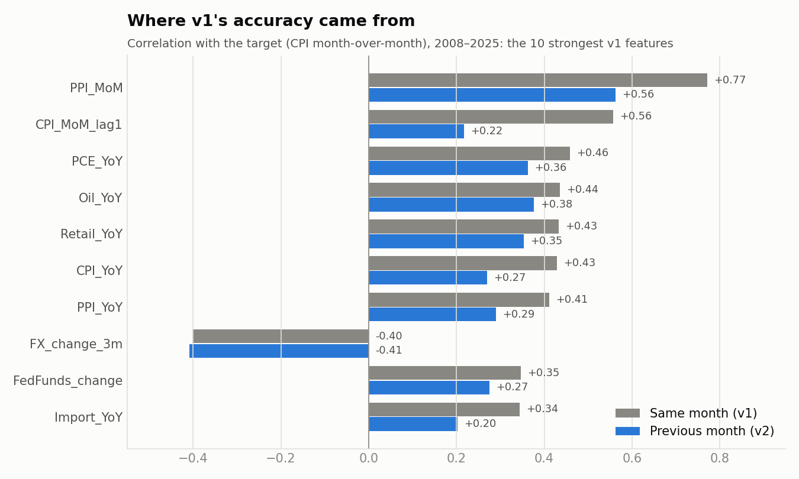

<header class="proj-head">
<a class="back" href="/#work">← All projects</a>

Baruch College Pre-MFE · Machine Learning · 2026

<h1>CPI inflation forecasting</h1>

Can macro data predict next month's US inflation? OLS, Ridge and Lasso trained on 28 engineered FRED features from 2008 to 2022, tested on 2023 to 2025. The most useful result is what happened when one flaw was fixed.

MethodsStationary feature engineeringOLS, Ridge, LassoTime-series cross-validationLook-ahead leakage detectionBootstrap prediction bandsNaive benchmarks
ToolsPythonscikit-learnpandasmatplotlibFRED data
DomainMacroeconomic forecasting · inflation · model validation

0.394 → −0.199

Lasso test R² once every feature is lagged a month (the leak removed)

15 of 28

features kept by Lasso in the leak-free model

36 months

out-of-sample test window, January 2023 to December 2025

<a class="btn primary" href="https://github.com/youness-yach/cpi-inflation-forecasting">Code and data</a>

</header>

<nav class="toc" aria-label="On this page">

On this page

<a href="#the-design">The design</a>
<a href="#the-flaw">The flaw</a>
<a href="#the-fix-and-an-honest-forecast">The fix</a>
<a href="#why-the-signal-vanishes">Why the signal vanishes</a>
<a href="#limitations">Limitations</a>
</nav>

## The design

The original coursework got the fundamentals right, and the corrected version keeps all of them:

- A stationary target (the monthly CPI change) and stationary inputs: growth rates and differences, never levels.
- Four economic channels: monetary (fed funds, M2 at 6, 12 and 18-month lags), cost-push (oil, import and producer prices, the dollar), demand (retail sales, spending, wages, the output gap) and financial stress (the credit spread).
- Penalties chosen with 5-fold `TimeSeriesSplit`, so each fold trains on the past and validates on the future.
- A test period no tuning step ever sees, and 10,000 bootstrap refits for prediction bands.

## The flaw

In the original, every feature was measured in the same month as the target. `CPI_YoY` is built from the target month's CPI, and producer prices are published around the same day as CPI. Lasso found the shortcut: its two largest weights reconstructed the answer. So v1 was a same-month nowcast, not a forecast.

<figure>

<figcaption><b>Figure 1.</b> Where v1's accuracy came from: correlations with the target collapse once features are measured a month earlier. <a href="https://github.com/youness-yach/cpi-inflation-forecasting/tree/main/reports/figures">Source</a></figcaption>
</figure>

## The fix and an honest forecast

Every feature is lagged one month, so month *t* is predicted only from what was known at the end of month *t − 1*. Those three lines are the only modelling change between the two notebooks.

<figure>

<figcaption><b>Figure 2.</b> With only past data, Lasso lands among the naive benchmarks: it beats "same as last month" and matches a trailing 12-month average, but not the historical mean. Unpenalised OLS overfits to nearly three times Lasso's error. <a href="https://github.com/youness-yach/cpi-inflation-forecasting/tree/main/reports/figures">Source</a></figcaption>
</figure>

## Why the signal vanishes

Relationships learned in 2008 to 2022 were driven by large shocks, and they don't carry into a calmer period. The correlation of last month's producer-price change with this month's CPI change fell from 0.60 in training to 0.03 in the test years, while CPI volatility fell from 0.34 to 0.13. Level bias explains only 8% of the leak-free model's error; the other 92% is missed month-to-month swings.

## Limitations

- Quarterly GDP enters before it's published in two of every three months; lagging it about 4 months would fix that.
- FRED serves revised data, not what forecasters had at the time (ALFRED vintages would fix that).
- The bootstrap ignores autocorrelation, so the bands are likely too narrow.

<a href="/projects/labor-analytics">← Marriott labour analytics</a><a href="/projects/semester-at-sea">Next: Semester at Sea →</a>

