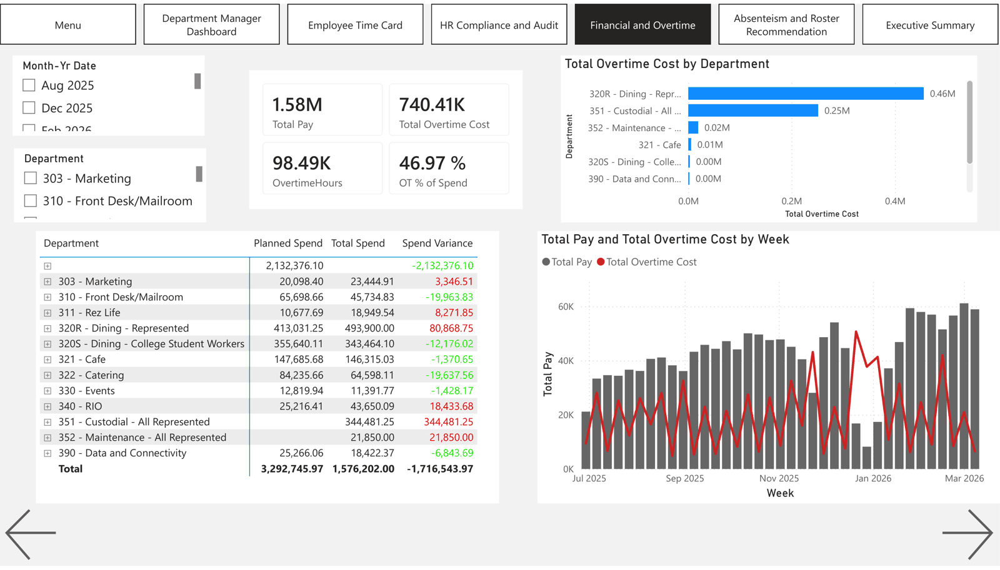

<header class="proj-head">
<a class="back" href="/#work">← All projects</a>

Hult MSc Business Analytics coursework · Business intelligence · 2026

<h1>Marriott labour analytics and audit</h1>

A Power BI suite that joins timekeeping with scheduling to track labour spend, overtime, attendance and compliance for about 225 hourly employees at a Marriott-managed property. A follow-up audit re-implements every measure in Python and corrects the ones that were wrong.

MethodsStar-schema data modellingDAX measuresPower QueryMeasure re-implementation and auditFuzzy record matchingPseudonymisation (HMAC)
ToolsPower BIDAXPower Query MPythonpandaspbixray
DomainWorkforce analytics · labour cost · HR compliance

47.4% → 4.4%

overtime's share of pay, after the audit removed paid leave from hours worked

32 · 49

DAX measures and calculated columns in a 2-fact, 3-dimension star schema

225

hourly employees, most of them part-time student workers

<a class="btn primary" href="https://github.com/youness-yach/labor-compliance-analytics">Code, model and coded data</a>

</header>

<nav class="toc" aria-label="On this page">

On this page

<a href="#the-problem">The problem</a>
<a href="#the-dashboard">The dashboard</a>
<a href="#the-audit">The audit</a>
<a href="#privacy">Privacy</a>
<a href="#limitations">Limitations</a>
</nav>

## The problem

Hotel managers need to see labour spend and compliance risk week by week: who is heading into overtime, who is breaching the 19-hour cap for student workers, and where attendance is slipping. The raw material is two operational exports that don't share a clean key: Kronos timekeeping punches and WhenToWork planned shifts.

## The dashboard

Seven pages, one per audience: department managers, supervisors, HR, finance, operations and leadership.

<figure>

<figcaption><b>Figure 1.</b> The department manager page: fiscal-year, month and week spend, hours and overtime by employee against the 19-hour line. Names and IDs are replaced by codes. <a href="https://github.com/youness-yach/labor-compliance-analytics/tree/main/docs/screenshots">Source</a></figcaption>
</figure>

<figure>

<figcaption><b>Figure 2.</b> The finance page: pay against overtime by week and department, and planned against actual spend. These are the original (v1) figures that the audit later corrected.</figcaption>
</figure>

## The audit

Re-running the model's logic on its own data showed the headline story was mostly an artefact.

<table>
<tr><th></th><th class="r">v1 dashboard</th><th class="r">v2 corrected</th></tr>
<tr><td>Overtime share of pay</td><td class="r num">47.4%</td><td class="r num"><b>4.4%</b></td></tr>
<tr><td>Overtime hours</td><td class="r num">19,852</td><td class="r num"><b>1,920</b></td></tr>
<tr><td>Absenteeism</td><td class="r num">−119% to 20% (unstable)</td><td class="r num"><b>7.1%</b></td></tr>
<tr><td>Impersonation cases</td><td class="r num">212</td><td class="r"><b>not measurable</b></td></tr>
<tr><td>Rounding "gaming"</td><td class="r num">≈ 5,000 shifts</td><td class="r"><b>at chance level</b></td></tr>
</table>

Why:

- **Paid leave was counted as hours worked,** so holidays pushed people over the 40-hour overtime line. About 90% of v1's overtime was leave.
- **The impersonation measure counted every employee,** and the punch-location fields in the export are empty, so impersonation can't be tested at all.
- **The overall rounding rate matched what random punch minutes produce** (25.1% against 24.9%), though 30 employees sit far above it.
- **The name join lost 44% of planned shifts.** A tiered matcher now links 69%.

What survives: Dining is still the largest overtime department, and part-timers routinely breach the 19-hour cap (73 of 196 in at least one week).

## Privacy

This is a real HR export. Names and employee IDs are replaced with codes (an HMAC-SHA256 of the ID under a key that never leaves the owner's machine). The Power BI file and raw exports are not published, and the employer is named only as "a Marriott-managed property".

## Limitations

- One property and one export period.
- A third of planned shifts still can't be matched to a timekeeping record, so no-show rates are estimates.

<a href="/projects/urban-heat-islands">← Urban heat islands</a><a href="/projects/cpi-forecasting">Next: CPI forecasting →</a>

