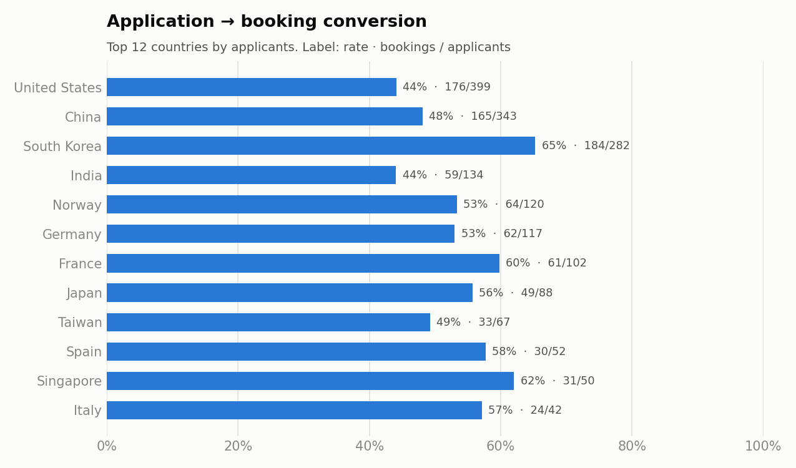

<header class="proj-head">
<a class="back" href="/#work">← All projects</a>

Hult MSc Business Analytics · Team coursework · SQL · 2025

<h1>Semester at Sea revenue in SQL</h1>

A relational model and MySQL analysis for a study-abroad voyage programme whose books run on a fiscal year (July to June) while its service runs on an academic year (August to August). The mismatch hid how much each voyage really earned, and where money leaked through cancellations.

MethodsRelational data modellingCTE pipelinesDate-range overlap joinsGenerated calendarsRevenue reconciliationPseudonymisation (HMAC)
ToolsMySQL 8MySQL WorkbenchSQLPythonpandas
DomainFinance analytics · revenue recognition · capacity planning

$1.42M

revenue the fiscal year misses: $17.75M fiscal against $19.17M on the academic calendar

82.2%

average occupancy over the fiscal year, against 630 cabins

$289,569

kept from 140 cancellations under the refund policy

<a class="btn primary" href="https://github.com/youness-yach/semester-at-sea-revenue-pipeline">Schema, queries and results</a>

</header>

<nav class="toc" aria-label="On this page">

On this page

<a href="#the-problem">The problem</a>
<a href="#data-model">Data model</a>
<a href="#results">Results</a>
<a href="#verification">Verification</a>
</nav>

## The problem

Summer voyages straddle the 30 June fiscal cut-off, so part of their revenue lands in the next fiscal year. Finance saw one number; operations lived another. The team modelled bookings, payments and voyages so revenue could be measured on either calendar.

## Data model

A 13-table model designed in MySQL Workbench; the 11 tables the queries use carry every primary and foreign key. Names are pseudonymised before loading: each person becomes a stable code, an HMAC-SHA256 of their ID, so joins still work and nobody can reverse a code without the key.

The queries use generated daily calendars to count cabin-nights, CTE pipelines, date-range overlap joins, `WITH ROLLUP` totals, tiered `CASE` logic for the refund policy and defensive date parsing.

## Results

<figure>

<figcaption><b>Figure 1.</b> Revenue against capacity. The ship is effectively full in Fall and Spring (97.8% and 95.5%) and half empty in Summer (45.3%). <a href="https://github.com/youness-yach/semester-at-sea-revenue-pipeline/tree/main/reports/figures">Source</a></figcaption>
</figure>

- **The fiscal year understates voyage revenue by $1.42M.** Measuring on the academic calendar lines revenue up with the service delivered.
- **Summer is the growth lever.** About 80% of the revenue lost to empty cabins falls between May and August. At 100% occupancy the year would have earned $21.61M.
- **Cancellations are revenue too.** Of 140 cancellations, 36 came within 14 days and forfeited full payment ($277,569); 24 partial refunds kept $500 each ($12,000).

<figure>

<figcaption><b>Figure 2.</b> The US and China send the most applicants but convert below 50%; South Korea converts at 65% on similar volume. <a href="https://github.com/youness-yach/semester-at-sea-revenue-pipeline/tree/main/reports/figures">Source</a></figcaption>
</figure>

## Verification

Every reported query was re-run end to end on MySQL 8 in September 2026. Three queries on unpaid balances and payment timing did not reproduce the team's original figures, so none of their results are reported. Loading also surfaced 55 duplicated booking IDs and payment rows for people missing from the people table; the repo documents how each is handled.

The dataset is the programme's real export and is not published; the repo includes everything needed to rebuild it from the source files.

<a href="/projects/cpi-forecasting">← CPI forecasting</a><a href="/projects/summr-strategy">Next: Summr strategy →</a>

