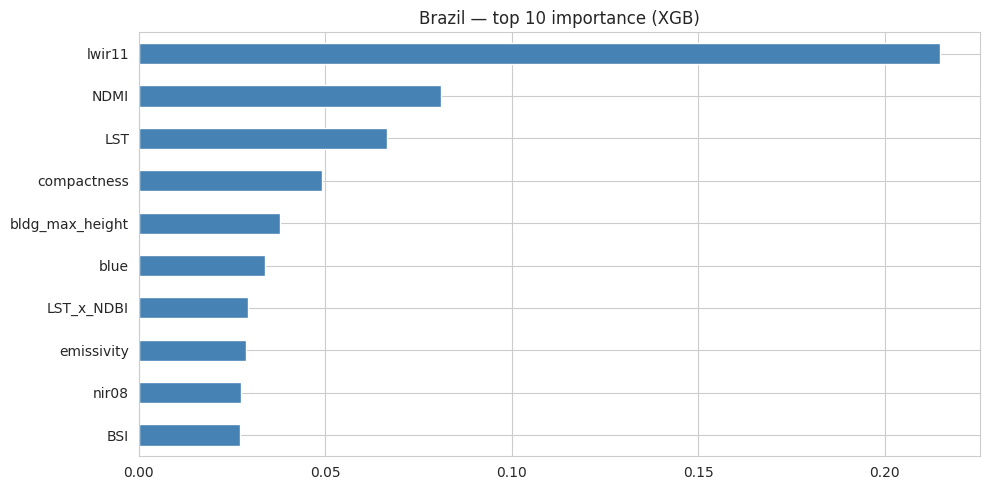
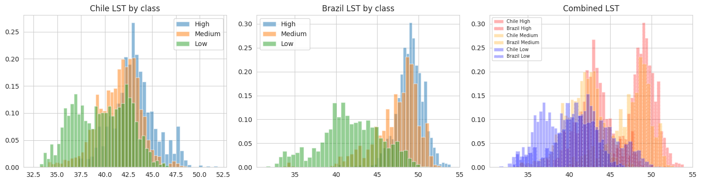

<header class="proj-head">
<a class="back" href="/#work">← All projects</a>
<p class="eyebrow">Hult Business Challenge II · Team 4 · 2026 · I led the modelling</p>
<h1>Urban heat islands from satellite data</h1>
<p class="lead">Classifying urban heat-island intensity (Low, Medium, High) at 100 m resolution from Sentinel-2, Landsat-8 and elevation data. The models learn on Rio de Janeiro and Santiago, then transfer to Freetown, Sierra Leone, a city with no labels of its own.</p>
<div class="skills">
<span class="k">Methods</span><span class="chips"><span class="chip m">Feature engineering (spectral indices)</span><span class="chip m">Random Forest</span><span class="chip m">XGBoost</span><span class="chip m">Class balancing</span><span class="chip m">Stratified cross-validation</span><span class="chip m">Quantile transform + PCA</span><span class="chip m">One-vs-rest transfer</span></span>
<span class="k">Tools</span><span class="chips"><span class="chip">Python</span><span class="chip">scikit-learn</span><span class="chip">XGBoost</span><span class="chip">xarray</span><span class="chip">rasterio</span><span class="chip">geopandas</span><span class="chip">Microsoft Fabric</span><span class="chip">Planetary Computer</span></span>
<span class="k">Domain</span><span class="v">Geospatial machine learning · climate risk · cross-domain transfer</span>
</div>
<div class="tiles">
<div class="tile"><div class="n">0.959</div><div class="l">weighted F1, Rio de Janeiro (XGBoost, 5-fold CV)</div></div>
<div class="tile"><div class="n">0.690</div><div class="l">weighted F1, Santiago (Random Forest, 20% hold-out)</div></div>
<div class="tile"><div class="n">0.58</div><div class="l">weighted F1, Freetown, a city the model never saw labels for (challenge leaderboard)</div></div>
</div>
<div class="btns">
<a class="btn primary" href="https://github.com/youness-yach/uhi-business-challenge">Code and data</a>
</div>
</header>

<div class="proj-body">
<nav class="toc" aria-label="On this page">
<p class="eyebrow">On this page</p>
<a href="#my-role">My role</a>
<a href="#the-problem">The problem</a>
<a href="#data-and-cloud-setup">Data and cloud setup</a>
<a href="#approach-and-results">Approach and results</a>
<a href="#limitations">Limitations</a>
<a href="#reproduce-it">Reproduce it</a>
</nav>
<div class="article">

## My role

<div class="role">I ran the machine-learning work: the model search and selection for Rio and Santiago (model families, resolutions, tuning, and picking the best fit for each city), and the transfer model that predicts Freetown. Satellite extraction was built by teammate Mickias Ambaye, whose <a href="https://github.com/Mickias-Ambaye/uhi-pipe">uhi_pipe</a> package is credited in the repo.</div>

## The problem

Cities trap heat unevenly, and the hottest blocks are where heat stress hits hardest. Ground sensors are sparse, so the question is whether satellite data can map heat-island intensity, and whether a model trained in one city still works in another.

## Data and cloud setup

<table>
<tr><th>Imagery</th><td>Sentinel-2 L2A, Landsat-8 thermal, a digital elevation model and 3D building footprints, from Microsoft Planetary Computer</td></tr>
<tr><th>Points</th><td class="num">50,150 labelled points across Rio and Santiago; Freetown unlabelled</td></tr>
<tr><th>Features</th><td>25 spectral indices, land-surface temperature, elevation, building morphology and 6 interaction terms</td></tr>
<tr><th>Compute</th><td>Microsoft Fabric notebooks reading and writing the Lakehouse; scenes loaded lazily in 2048 × 2048 chunks as uint16 and released after sampling; intermediate results cached as Parquet</td></tr>
</table>

## Approach and results

**Rio: tune for a strong heat signal.** A class-balanced XGBoost beat Random Forest in 5-fold cross-validation (0.959 against 0.947). Thermal bands dominate, then moisture (NDMI) and land-surface temperature, then building compactness.

<figure>

<figcaption><b>Figure 1.</b> What drives the Rio model: thermal infrared first, then moisture and surface temperature. <a href="https://github.com/youness-yach/uhi-business-challenge/tree/main/reports/figures">Source</a></figcaption>
</figure>

**Santiago: terrain, not materials.** Half the labels are Medium and overlap both extremes. Elevation and its interaction with temperature are the top features, because the Andean basin creates gradients surface materials don't explain. A depth-limited Random Forest on quantile-transformed features handled the ambiguous class better than boosting.

**Freetown: the transfer problem.** Raw temperatures don't carry across cities: Santiago's "High" sits near Rio's "Low".

<figure>

<figcaption><b>Figure 2.</b> Land-surface temperature by class and city. A model trained on Rio scores only 0.36 on Santiago, so absolute temperatures can't be transferred. <a href="https://github.com/youness-yach/uhi-business-challenge/tree/main/reports/figures">Source</a></figcaption>
</figure>

So the transfer model:

1. Quantile-transforms five thermal and spectral features separately for each city, so "hot for Freetown" lines up with "hot for Rio".
2. Compresses them to 3 principal components, which keep 96% of the variance.
3. Trains a one-vs-rest specialist per class on the source city that matches Freetown best for that class.
4. Averages the Random Forest and XGBoost specialists.

This scored **0.58** on the challenge leaderboard's hidden labels.

<figure>

<figcaption><b>Figure 3.</b> Heat-island class at every sample point: labelled in Rio and Santiago, predicted in Freetown. <a href="https://github.com/youness-yach/uhi-business-challenge/tree/main/reports/figures">Source</a></figcaption>
</figure>

## Limitations

- Freetown has no ground truth, so its error can't be broken down by class.
- Each city is one satellite composite from one date window. Seasonal data is the natural next step.

## Reproduce it

```bash
git clone https://github.com/youness-yach/uhi-business-challenge.git
cd uhi-business-challenge && pip install -e .
jupyter nbconvert --to notebook --execute notebooks/02_uhi_classification.ipynb
```

The Rio and Santiago results reproduce in about 4 minutes on a laptop. The same notebook runs on Microsoft Fabric.

<div class="pager"><a href="/quantitative-finance/geometry-of-risk/">← The Geometry of Risk</a><a href="/projects/labor-analytics">Next: Marriott labour analytics →</a></div>

</div>
</div>
