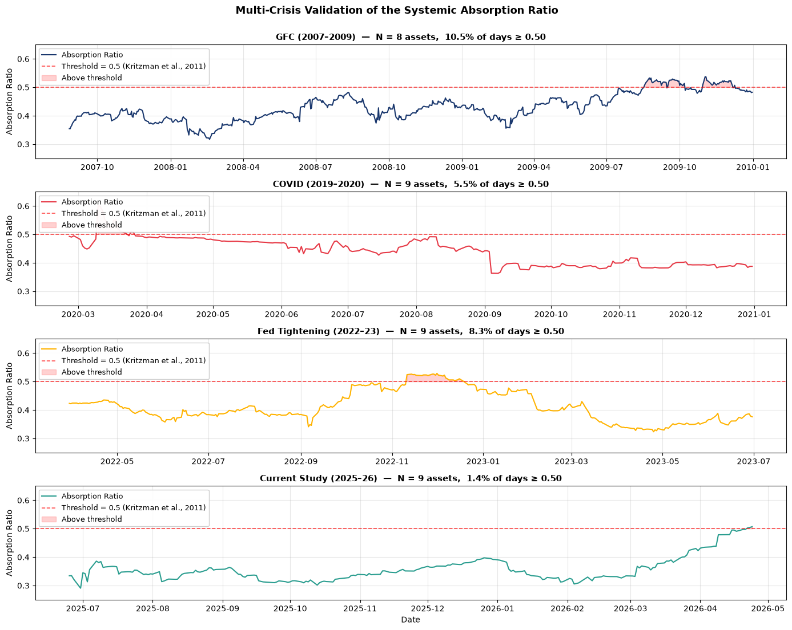

```js
const dash = FileAttachment("./data/risk-dashboard.json").json();
```

<header class="proj-head">
<a class="back" href="/work">← All projects</a>
<p class="eyebrow">Independent research · 2025 to 2026 · Sole author</p>
<h1>The Geometry of Risk</h1>
<p class="lead">A four-layer monitoring framework that reads systemic stress in the structure of nine global asset classes: how tightly they move together, who leads whom, how fat the tails are, and which regime the market is in.</p>
<div class="skills">
<span class="k">Methods</span><span class="chips"><span class="chip m">PCA / Absorption Ratio</span><span class="chip m">Correlation networks (MST)</span><span class="chip m">Granger causality + Bonferroni</span><span class="chip m">VAR / variance decomposition</span><span class="chip m">CVaR, tail dependence</span><span class="chip m">DCC-GARCH</span><span class="chip m">Gaussian HMM, out-of-sample</span></span>
<span class="k">Tools</span><span class="chips"><span class="chip">Python</span><span class="chip">pandas</span><span class="chip">statsmodels</span><span class="chip">scikit-learn</span><span class="chip">hmmlearn</span><span class="chip">arch</span><span class="chip">networkx</span></span>
<span class="k">Domain</span><span class="v">Systemic risk monitoring · multi-asset portfolios · financial econometrics</span>
</div>
<div class="tiles">
<div class="tile"><div class="n">4 of 4</div><div class="l">crisis windows breach the 0.50 Absorption Ratio threshold</div></div>
<div class="tile"><div class="n">4 of 72</div><div class="l">directional Granger links survive Bonferroni correction, all into Japan Equity</div></div>
<div class="tile"><div class="n">Apr 2026</div><div class="l">stress flagged by an HMM trained on 2011 to March 2025 and never refitted</div></div>
</div>
<div class="btns">
<a class="btn primary" href="https://papers.ssrn.com/sol3/papers.cfm?abstract_id=7521018">Read the paper (SSRN)</a>
<a class="btn" href="https://github.com/youness-yach/geometry-of-risk">Code and data</a>
<a class="btn mono" href="https://doi.org/10.2139/ssrn.7521018">DOI 10.2139/ssrn.7521018</a>
</div>
</header>

<div class="proj-body">
<nav class="toc" aria-label="On this page">
<p class="eyebrow">On this page</p>
<a href="#the-problem">The problem</a>
<a href="#data">Data</a>
<a href="#approach">Approach</a>
<a href="#results">Results</a>
<a href="#live-dashboard">Live dashboard</a>
<a href="#limitations">Limitations</a>
<a href="#reproduce-it">Reproduce it</a>
</nav>
<div class="article">

## The problem

Diversification fails exactly when it's needed. In a crisis, assets that usually move independently start moving as one block, and a single correlation number hides it. I wanted a monitor that reads the structure of the market directly, and that a risk team could reproduce.

## Data

<table>
<tr><th>Universe</th><td>9 asset classes: US, EU, Japan, China and emerging-market equity; gold; oil; the US dollar index; the US 10-year yield</td></tr>
<tr><th>Study window</th><td class="num">24 Apr 2025 to 24 Apr 2026 · N = 261 trading days</td></tr>
<tr><th>Long history</th><td class="num">2011 to 2026 · N = 3,472 trading days</td></tr>
<tr><th>Sources</th><td>Yahoo Finance prices; FRED CPI and 10-year yield; a frozen snapshot is committed to the repo</td></tr>
</table>

## Approach

1. **Network topology.** Turn correlations into distances, then map the market with a minimum spanning tree, multidimensional scaling and Ward clustering.
2. **Causality.** Test all 72 directed pairs for Granger causality, keep only what survives Bonferroni correction, and cross-check with joint F-tests and variance decomposition in a nine-asset VAR.
3. **Tail risk.** Measure CVaR and lower-tail dependence directly instead of trusting variance.
4. **Regimes.** Track the Absorption Ratio against the 0.50 threshold of Kritzman et al. (2011), and classify regimes with a Gaussian HMM trained on 2011 to March 2025, then applied to the next year without refitting.

## Results

<figure>

<figcaption><b>Figure 1.</b> The Absorption Ratio crosses 0.50 in all four episodes: GFC peak 0.537, COVID 0.601, Fed tightening 0.529, the 2025–26 study window 0.507. <a href="https://github.com/youness-yach/geometry-of-risk/tree/main/figures">Source</a></figcaption>
</figure>

The current-study breach is brief and marginal, 3 days at the very end of the window. That's why the other three layers matter.

<figure>

<figcaption><b>Figure 2.</b> Of 72 directed pairs, 4 survive the Bonferroni threshold (α* = 0.0007): US, EU, China and emerging-market equity each lead Japanese equity. <a href="https://github.com/youness-yach/geometry-of-risk/tree/main/figures">Source</a></figcaption>
</figure>

<figure>

<figcaption><b>Figure 3.</b> Out of sample, the HMM labels 4.1% of the year as stress (its training base rate was 25.6%), in two episodes: the April 2025 tariff shock and the April 2026 peak. <a href="https://github.com/youness-yach/geometry-of-risk/tree/main/figures">Source</a></figcaption>
</figure>

Two more findings: the correlation-network tree and a parametric DCC-GARCH tree share 5 of 8 links, and oil is quasi-exogenous in the conditional mean (joint F-test p = 0.38 and 0.33) while still explaining 11–16% of the 10-day forecast-error variance of EU equity, emerging markets and the 10-year yield.

## Live dashboard

The framework's core layer, refitted on current market data. It shows the tool running; the paper's results come from the fixed, out-of-sample-validated model in the repo.

```js
const current = dash.current;
display(html`<div class="snapshot">
  <div><dt>Absorption Ratio</dt><dd>${current.absorption_ratio.toFixed(3)}</dd></div>
  <div><dt>Accelerator (z)</dt><dd>${current.accelerator_zscore === null ? "—" : current.accelerator_zscore.toFixed(2)}</dd></div>
  <div><dt>Regime</dt><dd><span class="regime-badge regime-${current.regime}">${current.regime}</span></dd></div>
  <div><dt>As of</dt><dd>${current.as_of}</dd></div>
</div>`);
```

```js
const parseDate = d3.utcParse("%Y-%m-%d");
const arSeries = dash.absorption_ratio.filter((d) => d.value !== null).map((d) => ({date: parseDate(d.date), value: d.value}));
const regimeByDate = new Map(dash.regime.map((d) => [d.date, d.state]));
const regimeColor = {Calm: "#2E7D4F", Transitional: "#C98A2B", Stress: "#B23A3A"};
const regimeBands = dash.absorption_ratio
  .filter((d) => d.value !== null && regimeByDate.has(d.date))
  .map((d) => ({date: parseDate(d.date), state: regimeByDate.get(d.date)}));
const axisStyle = {background: "transparent", color: "#5C5A55", fontFamily: "IBM Plex Mono, monospace", fontSize: "11px"};
```

<div class="dash-chart">
<h4>Rolling Absorption Ratio · 60-day window, regime-shaded</h4>

```js
Plot.plot({
  width: 740, height: 250, marginLeft: 40, style: axisStyle,
  x: {type: "utc", label: null},
  y: {domain: [0, 1], label: "Absorption Ratio", grid: true},
  marks: [
    Plot.rectY(regimeBands, {x: "date", interval: "day", y1: 0, y2: 1, fill: (d) => regimeColor[d.state], fillOpacity: 0.12}),
    Plot.ruleY([0.5], {stroke: "#1A1A1A", strokeDasharray: "4,3"}),
    Plot.lineY(arSeries, {x: "date", y: "value", stroke: "#1F4E79", strokeWidth: 1.6})
  ]
})
```

</div>
<div class="dash-legend"><span><span class="sw" style="background:#2E7D4F33"></span>Calm</span><span><span class="sw" style="background:#C98A2B33"></span>Transitional</span><span><span class="sw" style="background:#B23A3A33"></span>Stress</span><span>Dashed line: 0.50 threshold (Kritzman et al., 2011)</span></div>

```js
const accelSeries = dash.accelerator.filter((d) => d.value !== null).map((d) => ({date: parseDate(d.date), value: d.value}));
```

<div class="dash-chart">
<h4>Accelerator · standardised 15-day change in the Absorption Ratio</h4>

```js
Plot.plot({
  width: 740, height: 170, marginLeft: 40, style: axisStyle,
  x: {type: "utc", label: null},
  y: {label: "z-score", grid: true},
  marks: [
    Plot.ruleY([0], {stroke: "#C9C4B9"}),
    Plot.ruleY([2, -2], {stroke: "#1A1A1A", strokeDasharray: "4,3"}),
    Plot.lineY(accelSeries, {x: "date", y: "value", stroke: "#1F4E79", strokeWidth: 1.1})
  ]
})
```

</div>
<div class="dash-legend"><span>Above +2σ: risk building fast</span><span>Below −2σ: risk easing fast</span></div>

```js
const assets = dash.correlation_matrix.assets;
const label = (a) => a.replace(/_/g, " ");
const corrCells = [];
dash.correlation_matrix.values.forEach((row, i) => row.forEach((v, j) => corrCells.push({x: label(assets[j]), y: label(assets[i]), value: v})));
```

<div class="dash-chart">
<h4>Correlation matrix · trailing 60 trading days</h4>

```js
Plot.plot({
  width: 740, height: 440, marginLeft: 110, marginBottom: 90, style: axisStyle,
  x: {domain: assets.map(label), label: null, tickRotate: -35},
  y: {domain: assets.map(label), label: null},
  color: {type: "linear", scheme: "RdBu", domain: [-1, 1], legend: true, label: "correlation"},
  marks: [
    Plot.cell(corrCells, {x: "x", y: "y", fill: "value", inset: 0.5}),
    Plot.text(corrCells, {x: "x", y: "y", text: (d) => d.value.toFixed(2), fill: (d) => Math.abs(d.value) > 0.6 ? "white" : "#1A1A1A", fontSize: 10})
  ]
})
```

</div>

<p class="muted" style="font-size:15px">Data: Yahoo Finance, 9 assets. PCA from scikit-learn; 3-state Gaussian HMM from hmmlearn, refitted on each update. Generated ${new Date(dash.generated_at).toUTCString()}.</p>

## Limitations

- 261 trading days is short for systemic-risk work, so findings specific to this window are exploratory.
- Granger tests assume linear dependence; only Bonferroni-robust links are treated as solid.
- Next steps: walk-forward HMM evaluation, non-linear causality (transfer entropy) and copula-based tail dependence.

## Reproduce it

```bash
git clone https://github.com/youness-yach/geometry-of-risk
pip install -r requirements.txt
jupyter nbconvert --to notebook --execute notebooks/geometry_of_risk.ipynb
```

The repo runs on the frozen study window, so every run gives the same result. A few secondary figures differ slightly from the paper, which used a live download in May 2026; the repo documents each difference.

<div class="pager"><a href="/work">← All projects</a><a href="/projects/urban-heat-islands">Next: Urban heat islands →</a></div>

</div>
</div>
